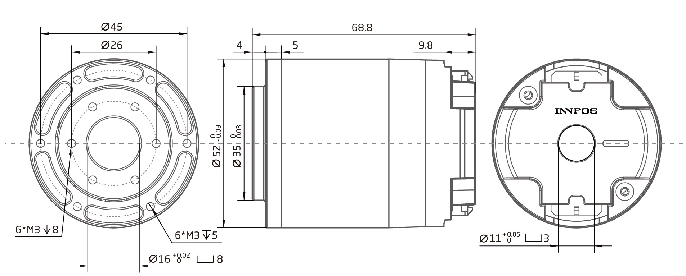
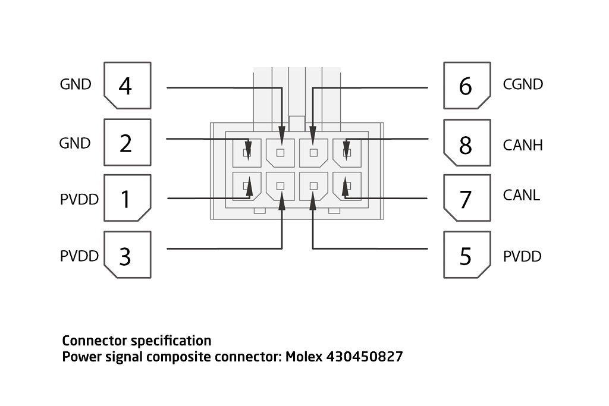

# Robot actuator module

This work is inspired by the INNFOS [SCA QDD Lite-NE30-36](http://wiki.innfos.com/wiki/en/index.html#!pages/QDD%20Lite-NE30-36_v1_8.md) robot actuator. The goal is a general purpose robot actuator with the features:

- planetary gearbox for high torque (harmonic drive?)
- brushless motor for high power in small space
- control unit embedded
- only one connector for power and signal, 1 daisy-chain outlet

It won't be as compact as the industrial, but maybe available and in the price range of the [kickstarter campain](https://www.kickstarter.com/projects/1383636492/the-smallest-servomotor-robotic-arm) ($99 for one Lite-NE30-36 actuator). And I'm not sure if it is possible. INNFOS has 70 people full time in R&D for their actuators. That's not easy to compete in a weekend project.

## Information

## Connector

There is a plethoria of connectors available. The idea of just one connector for power (high current and voltage) and signal (low voltage, high frequency) has been solved differently. INNFOS went for Molex 430450827. With 3.0mm pitch this connector is rated for 7A and each 2 pins are used for power and ground with 48V (connector up to 250V) the maximum power with this conncetor is 14A x 48V = 672W. This might be sufficient for hoppy applications.

### Alternatives:

- [3.0mm C3030HF-6P](https://www.thegioiic.com/products/dau-noi-day-3-0mm-8-chan) 
- [3.0mm 3046-2*xx 43045-2*04](https://www.thegioiic.com/products/dau-noi-3-0mm-8pin-cong-han-pcb) 250V 7A
- [VH3.96](https://www.thegioiic.com/products/bo-dau-noi-vh3-96-4-chan-duc-cai) 250 VAC 7A
- [8-pin 5557-5559 4.2mm Wire Connector](https://www.thegioiic.com/products/dau-noi-day-duc-5557-5559-4-2mm-8-chan)
- [Molex 5.08](https://www.thegioiic.com/products/dau-noi-day-duc-5-08mm-4pin) (old HDD in computers) 350V 10A
- [XT60](https://www.servocity.com/male-xt60-connector) just for power 60A in bullet style Nylon connector

### Terminal pin function

| Label | Signal  | color | Features                           |
|-------|---------|-------|------------------------------------|
| 1     | PVDD    | black | Positive power supply              |
| 3     | PVDD    | black |                                    |
| 5     | PVDD    | black |                                    |
| 2     | GND     | black | Power supply grounding             |
| 4     | GND     | black |                                    |
| 6     | CAN-GND | gray  | CAN communication signal ground    |
| 7     | CAN-L   | gray  | CAN communication low signal line  |
| 8     | CAN-H   | gray  | CAN communication high signal line |

Described [here](http://wiki.innfos.com/wiki/en/index.html#!pages/QDD%20Lite-NE30-36_v1_8.md) as well. If it works, why not copy?

## Background information

There are reasons for brushless motors and the like. Here is a small collection of information:

- [Power of brushless motors]()
- [ESC for BLDC with Arduino - HowToMechatronics](https://youtu.be/uOQk8SJso6Q?t=157)
