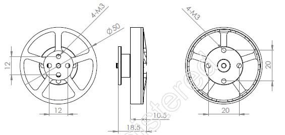

# Calculations

For the actuator we have to consider maximum power, torque and holding force. How do these relate to one another? Stored in Jupyter notebook.

The BLDC 5010 delives up to 200W and 3000 rpm at 14 V, so might be suitable for an experiment for $15.

With the gearbox 33:1 we get 33Nm compared to 1Nm at 30W (estimated, calculation follows).

| Test Data |              |              |            |       |                    |                   |
|-----------|--------------|--------------|------------|-------|--------------------|-------------------|
| No\.      | Voltage\(V\) | Current\(A\) | Power\(W\) | RPM/V | Quiet Tensile\(g\) | Pull/Power\(g/w\) |
| 1         | 14           | 0\.2         | 2\.8       | 1000  | 81                 | 28\.9             |
| 2         | 14           | 0\.4         | 5\.6       | 1200  | 110                | 19\.6             |
| 3         | 14           | 0\.6         | 8\.4       | 1400  | 160                | 19                |
| 4         | 14           | 1\.1         | 15\.4      | 1600  | 220                | 14\.3             |
| 5         | 14           | 1\.7         | 23\.8      | 1800  | 288                | 12\.1             |
| 6         | 14           | 2\.4         | 33\.6      | 2000  | 350                | 10\.4             |
| 7         | 14           | 3\.4         | 47\.6      | 2200  | 430                | 9                 |
| 8         | 14           | 4\.2         | 58\.8      | 2400  | 490                | 8\.3              |
| 9         | 14           | 5\.9         | 82\.6      | 2600  | 570                | 6\.9              |
| 10        | 14           | 8\.5         | 119        | 2800  | 730                | 6\.1              |
| 11        | 14           | 10\.7        | 149\.8     | 3000  | 800                | 5\.3              |

Might not fit in our 52mm dimension experiment, but we'll see ...
