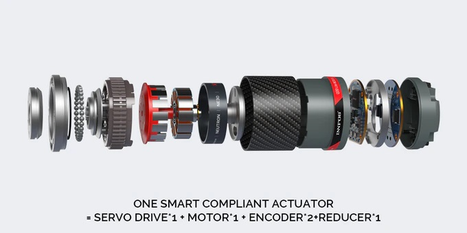
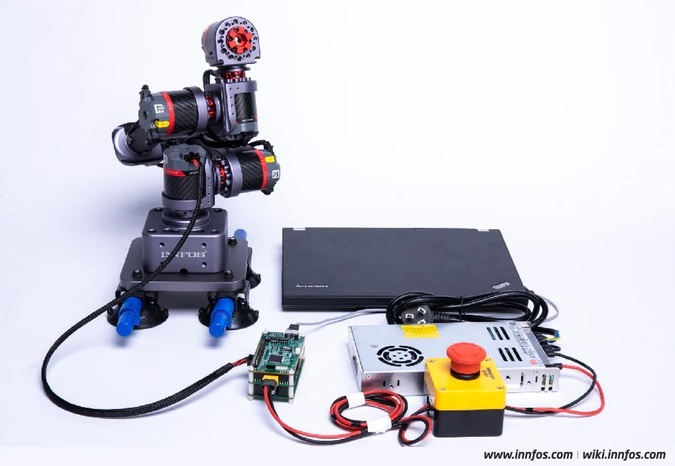
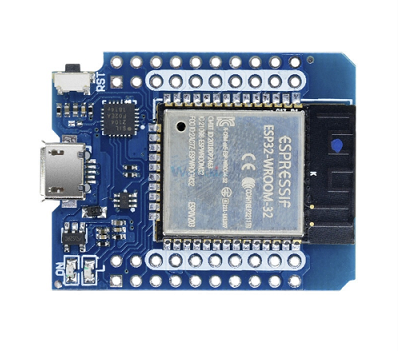

# Driver board

It has several components
- Molex [3.0mm 3046-2*xx 43045-2*04](https://www.thegioiic.com/products/dau-noi-3-0mm-8pin-cong-han-pcb) connector for power 250V 7A and CAN bus
- STM32F103C8T6 electronics driver with micro-USB
- ESC self made with inspiration from Great Scott!
- Temperature sensor TM56
- Magnetic encoder AS5600 12bit - with gearbox 33:1 (5bit) we get 17 bit or 131072 steps per revolution
- 17 bit relates to 0.00275 degrees, thats 0.16 Arc Minutes or 10 Arc seconds
- step down converter 24V to 5V for 32bit cpu
- LED 5050 for feedback
- something ...

Together it looks like this:

While the BLDC, power supply and emergency power of can be bought, the ECB has to be designed. The communication protocol can be taken from INNFOS. A suitable gearbox is currently not available. As this project evolves that might change. Here are the designed parts:

## 1. Gearbox

2 stage epicyclic gearbox with sun 1M10T, plantes 1M19T and ring 1M48T for a reduction ratio of 5.8:1 from 1 +  48/10. Staged this gives 33:1. More details in [the gearbox folder](gearbox/)

## 2. Brushless motor

I investigated the power per kilogram and ...

## 3. Driver board

I looked at the design of John Lauer and while I like the ESP32 I will start to use the blue pill since it natively supports CAN, has 32bit as well and can be updated with micro-USB.

The encoder should be integrated on this board. In many cases this is done with a magnetic encoder like AS5600 (12bit - $5) or AS5048A (14bit - $13). Combined with a gearbox of 33.6:1 reduction (5 bit) one gets a resolution of 19 bit like the NE30-36. Compared to a backlash of 18 Arc min (18/60 of a degree) that's 360/524288 = 0.04 Arc min or 2.47 Arc sec. The encoder is 436x more precise than the gearbox can achieve.

## 4. Power supply

Not much to write. Got it for $10 in Ho Chi Minh City. The emergency power of was another $5 from Aliexpress.

## 5. ECB Ethernet to CAN bridge

This design will take some time.

## 6. Communication protocol for CAN bus

Details follw

## Background

This work is inspired by the INNFOS [SCA QDD Lite-NE30-36](http://wiki.innfos.com/wiki/en/index.html#!pages/QDD%20Lite-NE30-36_v1_8.md) robot actuator and [John Lauers Chilipepr robot actuator](https://github.com/chilipeppr/robot-actuator-esp32-v8). The goal is a general purpose robot actuator with the features:

- planetary gearbox for high torque (harmonic drive?)
- brushless motor for high power in small space
- control unit embedded
- only one connector for power and signal, 1 daisy-chain outlet

It won't be as compact as the industrial, but maybe available and in the price range of the [kickstarter campain](https://www.kickstarter.com/projects/1383636492/the-smallest-servomotor-robotic-arm) ($99 for one Lite-NE30-36 actuator). And I'm not sure if it is possible. INNFOS has 70 people full time in R&D for their actuators. That's not easy to compete in a weekend project.

## Information

The components for INNFOS and ChiliPepr indicate the different sections that need to be designed or equipped:

We need:

1. Gearbox with reduction ratio 1:40
2. Brushless motor BLDC
3. Controller board with motor driverand encoder
4. Power and data interface, temperature sensor and status LED 

Additionally we need:

5. Power supply 24V - 42V
6. ECB Ethernet to CAN bridge, bus logic
7. Emergency Power Off
8. Communication protocol for CAN bus

No. 2, 5 and 7 can be bought. 8 can be [copied from INNFOS](http://wiki.innfos.com/wiki/en/index.html#!pages/CAN_Communication_Protocol.md). Together it looks like:

And this setup has __no input__ yet to start "auto learning mode" or the like. A raspberry with touchscreen would do the trick. Combining the power supply, ECB and Rasberry Pi in housing leaves only 2 components: robot and controller. Maybe common in 5 years, but today ...

## Connector

There is a plethoria of connectors available. The idea of just one connector for power (high current and voltage) and signal (low voltage, high frequency) has been solved differently. INNFOS went for Molex 430450827. With 3.0mm pitch this connector is rated for 7A and each 2 pins are used for power and ground with 48V (connector up to 250V) the maximum power with this conncetor is 14A x 48V = 672W. This might be sufficient for hoppy applications.

### Alternatives:

- [3.0mm C3030HF-6P](https://www.thegioiic.com/products/dau-noi-day-3-0mm-8-chan) 
- [3.0mm 3046-2*xx 43045-2*04](https://www.thegioiic.com/products/dau-noi-3-0mm-8pin-cong-han-pcb) 250V 7A
- [VH3.96](https://www.thegioiic.com/products/bo-dau-noi-vh3-96-4-chan-duc-cai) 250 VAC 7A
- [8-pin 5557-5559 4.2mm Wire Connector](https://www.thegioiic.com/products/dau-noi-day-duc-5557-5559-4-2mm-8-chan)
- [Molex 5.08](https://www.thegioiic.com/products/dau-noi-day-duc-5-08mm-4pin) (old HDD in computers) 350V 10A
- [XT60](https://www.servocity.com/male-xt60-connector) just for power 60A in bullet style Nylon connector

### Terminal pin function

| Label | Signal  | color | Features                           |
|-------|---------|-------|------------------------------------|
| 1     | PVDD    | black | Positive power supply              |
| 3     | PVDD    | black |                                    |
| 5     | PVDD    | black |                                    |
| 2     | GND     | black | Power supply grounding             |
| 4     | GND     | black |                                    |
| 6     | CAN-GND | gray  | CAN communication signal ground    |
| 7     | CAN-L   | gray  | CAN communication low signal line  |
| 8     | CAN-H   | gray  | CAN communication high signal line |

Described [here](http://wiki.innfos.com/wiki/en/index.html#!pages/QDD%20Lite-NE30-36_v1_8.md) as well. If it works, why not copy?

### Chilipepr approach with John Lauer

He only uses 24 Volt and exports them trough 2 sliders (1 Ohm?) in the bearing of each actuator. Less wiring and theoretically 360 degrees, since the ESP32s are connected wirelessly - but I think that wireless is not reliable enough. That's more a gimmick idea and introduces avoidable causes of error, together with the power supply chain for high currents.

## Gearbox

### Harmonic drive

The harmonic drive should be expensive and hard to create. With all the 3D printers out there one would assume some working examples exists. Yet Thingiverse is a testimony for failure form maschine building students. Examples:

- [Working example with flexible filament](https://www.thingiverse.com/thing:1966551) from bartding, 2016
- [Good looking example that needs NEMA 23](https://www.thingiverse.com/thing:2735297) from Trollox, 2017
- [Only for fidget](https://www.thingiverse.com/thing:3181288) by Hoshiimiki, 2018
- [Strain Wave Gear](https://www.thingiverse.com/thing:3644830) by tanmayburde, 2019 - not with NEMA17, PLA not stiff enough

### Planetary Gear Box

Used by many others. Chilipepr used the updated design from 

## Controller board

For the ESP32 there is a [D1 Mini Board](https://www.aliexpress.com/item/4000650379995.html?spm=a2g0o.productlist.0.0.5f42586aifMlh3&algo_pvid=f3bdcfc9-ecc9-4dc3-8140-84f1ccf06fae&algo_expid=f3bdcfc9-ecc9-4dc3-8140-84f1ccf06fae-18&btsid=0ab6f82415841196558331203e3206&ws_ab_test=searchweb0_0,searchweb201602_,searchweb201603_) so only one board has to be designed to stack on top of it - like Chilipeprs approach. Has micro-USB for programming.

## Background information

There are reasons for brushless motors and the like. Here is a small collection of information:

- [Torque comparison servo - brushless](https://youtu.be/qTVohNscEmM?t=12) by Skyentific, Nov. 2018
- [Power of brushless motors](https://youtu.be/8AziOykde30?t=701) Skyentific, video
- [Calculator rpm power voltage BLDC](https://www.ecalc.ch/torquecalc.php) from ecalc.ch
- [Cycloidal 3D printed actuator](https://hackaday.io/project/157812-3d-printed-robot-actuator) by Paul Gould
- [Reason for brushless + encoder](https://youtu.be/p4ltHDpxrbI?t=430) by Marco Reps, video
- [ESC for BLDC with Arduino](https://youtu.be/uOQk8SJso6Q?t=157) by HowToMechatronics
- [Review QDD Lite-NE30-36](https://youtu.be/0sgR_RaxYu4) by Skyentific, video. For the high current they add a big capacitor: [video at 2:20](https://youtu.be/0sgR_RaxYu4?t=140)
- [Lite NE30-36 from inside video](https://youtu.be/UazlY0nfZKw)
- [Inverse kinematics applied to 5DoF](https://youtu.be/2YTb6gWo40Q) in Basel, stepper and belts

## History

> 2020/03/19

The first gears where designed in Fusion 360 with the spurn gears tool.

> 2020/04/10

A video was published on March 25 this year how to design a custom PCB with components and a STM32F4 CPU:

[https://youtu.be/t5phi3nT8OU](https://youtu.be/t5phi3nT8OU)

I might use this tutorial and inspiration
