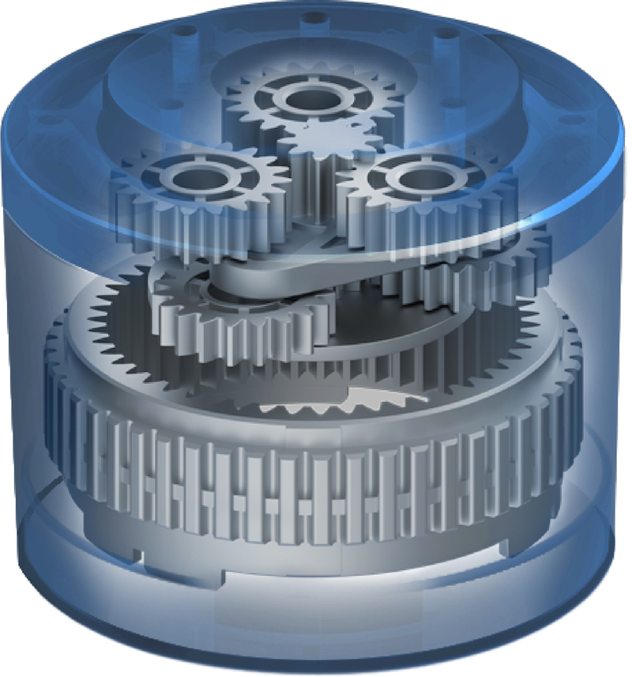

# Gearbox

The gearbox has two stages with each reduction ratio of 5.8 to achieve a combined reduction ration of 33.6. For the NEMA 17 servo this reduces the 1000 rpm max to 30 rpm. A 360º turn will take 2 seconds. That's a good value in a robot.

The torque might increase as well. Labeled at 0.4 Nm if increased by 30x we might reach 12 Nm.

To compare with a BLDC like the INNFOS SCA QDD Lite-NE30-36 it has these values: 
- No load 167 rpm vs. 30 rpm
- Load 56 rpm vs. 30 rpm
- Nominal torque 2.3 Nm vs. 12 Nm
- Peak torque 10 Nm vs. 12 Nm
- Power 42 VDC vs. 24 VDC or 3.96 VDC (?)
- Nominal power current 4.8 A vs. 1.68 A (Nema 17)
- Peak current 16.5 A vs. ???
- Weight 232 g vs. 280 g (just the [NEMA 17](https://www.thegioiic.com/products/sl42sth40-1684a-dong-co-buoc-nema17-42x42mm))

I couldn't find a successful printed strain wave design in the internet - despite many attemps. 
