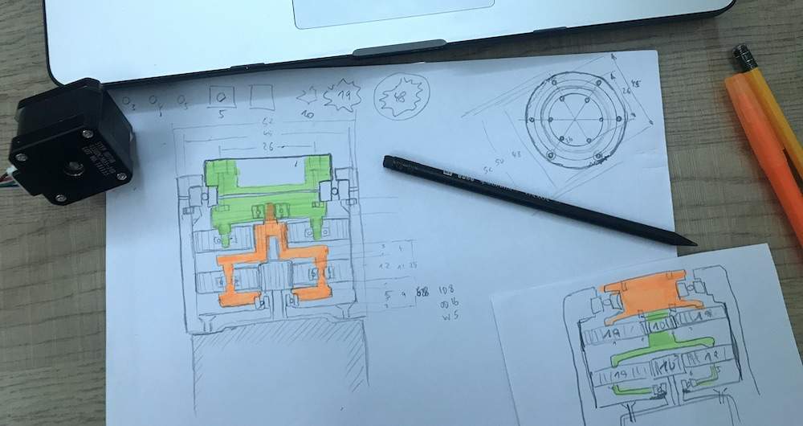

# Gearbox

The gearbox has two stages with each reduction ratio of 5.8 to achieve a combined reduction ration of 33.6. For the NEMA 17 servo this reduces the 1000 rpm max to 30 rpm. A 360º turn will take 2 seconds. That's a good value in a robot.

The torque might increase as well. Labeled at 0.4 Nm if increased by 30x we might reach 12 Nm.

To compare with a BLDC like the INNFOS SCA QDD Lite-NE30-36 it has these values: 
- No load 167 rpm vs. 30 rpm
- Load 56 rpm vs. 30 rpm
- Nominal torque 2.3 Nm vs. 12 Nm
- Peak torque 10 Nm vs. 12 Nm
- Power 42 VDC vs. 24 VDC or 3.96 VDC (?)
- Nominal power current 4.8 A vs. 1.68 A (Nema 17)
- Peak current 16.5 A vs. ???
- Weight 232 g vs. 280 g (just the [NEMA 17](https://www.thegioiic.com/products/sl42sth40-1684a-dong-co-buoc-nema17-42x42mm))

I couldn't find a successful printed strain wave design in the internet - despite many attemps. 

## History

> 2020/03/16

Inspired by the INNFOS SCA QDD Lite-NE30-36 I watched some YouTube videos and investigated the possibility of creating an actuator from printed PLA and some stepper motors. Looking at [John Lauers](https://youtu.be/4o3d7_WZ_DQ) and [Jeff Kerr](https://youtu.be/7u_UjMB8tJI) (Jan 2019) [WE-R2.4 Six-Axis Robot Arm](https://www.thingiverse.com/thing:3327968) show that the combination of stepper motors and 3D printed gears could work. The project can be found under [LoboCNC](https://www.thingiverse.com/LoboCNC/about) in [Thingiverse](https://www.thingiverse.com/thing:3327968) (non-commercial).

Printed bearings are not very good, as I observed myself with my [EEZYbotARM MK2](https://www.thingiverse.com/thing:1454048) from Carlo Franciscone ([daGHIZmo](https://www.thingiverse.com/daGHIZmo/about)) April 2017. So I got some 623ZZ bearings (ID 3mm OD 10mm Width 4mm) and a few 6806 ZZ bearings from NTN (30x42x7mm) on the local Yersin market for $2. The 6706 was not available.

Parameters of some common bearings:

> 2020/03/19

Stefan from [CNC Kitchen](https://www.youtube.com/channel/UCiczXOhGpvoQGhOL16EZiTg) (another german ;) printed a 1M12T gear with [PLA in 2017](https://youtu.be/rHim8AVU9qw) and tested them again in a [video 2019](https://youtu.be/vuJmWKsCYcU). Modulus 1 is therefore usable and printable with a 0.4mm nozzle and PLA. I'll give it a try. Started to design in Fusion 360, using the information given in several tutorials and other videos.

Let's start with a rough sketch for the design of the 10/19/48 planetary gearbox (epicyclical gear).

> 2020/03/30

Finally school is open after 2 weeks of quarantine for all teachers. Printed the designed gears:
