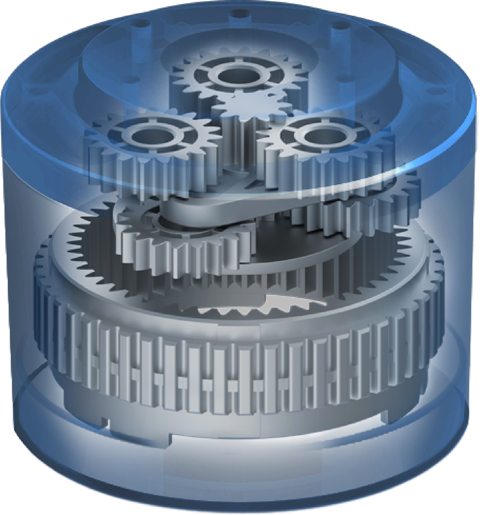

# Reducer 

Let's start with epicyclic gearing. Should be simple and cheap, used in powerdrills with battery everywhere.

## Chilipepr and John Lauer

If you look at this project, you see that the tolerance of a 3D printer is to big for many mechanical parts. For example the bearing, I experienced the same for my EZZYrobotARM MK2 - after sanding it was still rough.

Tolerance here: Lathe and machining have 5 µm tolerance or less. 3D printer layer height is usually 0.2mm or 200 µm - that's 40x worse!

I chose bearing with a $2 bearing 6706 or the like. Much better.

Same for gears.

## INNFOS

Look at one of their SCA - they stack two planetary gears on top of one another. Look here:

Sun gear 10 teeth, planets 19 gears. Therefore the ring has 48 gears. Reduction ratio R = 1 + 48/10 = 5.8. Stacked on one another you get 5.8^2 = 33.64
