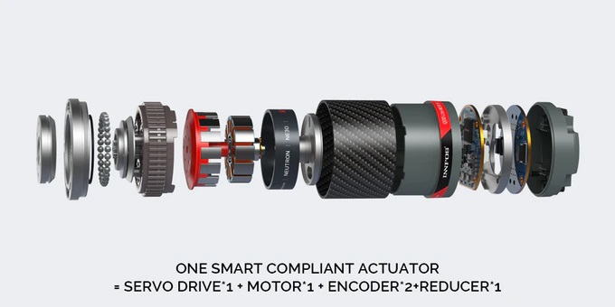
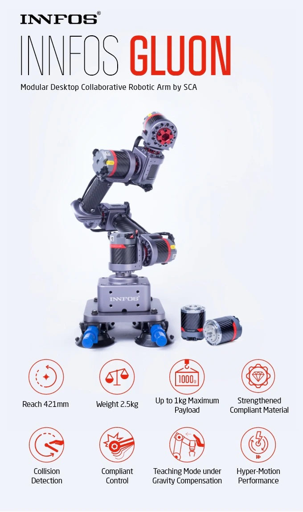

# Pictures

Just a folder to collect all the pictures used in this project

According to the kickstarter page they have 70 people in R&D. If they work full time, how can I compete in a weekend project?
